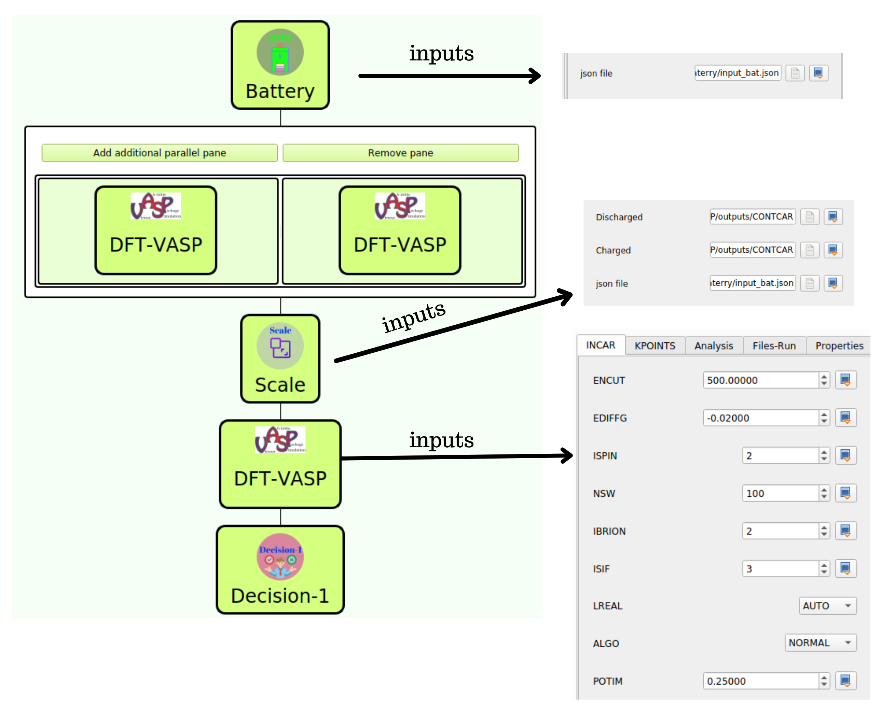

# Battery-Electrodes

This workflow uses the SimStack framework features to simulate DFT calculations based on the VASP (QE) code to evaluate the mechanical and  thermodynamic stability of the potential cathode material as input structures obtained experimentally or from the Materials Project database. Here, we combine four different WaNos: Battery, DFT-VASP, Scale, and Decision-1, set up a system, and choose the methods embedded in the DFT approach using VASP code. 

Using the drag-and-drop feature of Simstack, we can build the workflow displayed in KIT-Figure 1 in four steps. The Battery WaNo receives the .json file as input with the material-id, ion type, energy above the convex hull, and volume change between charged/discharged unit cells. In the second step, we add the DFT-VASP WaNo inside the Parallel control to generate the POSCAR files of charged/discharged unit cells. In the third step, we insert the Scale WaNo, which will receive the generated scaled supercell without any defect from the previous optimized charged/discharged unit cells. The Decision-1 WaNo extracts the volumes of the last optimized charged/discharged unit cells. The output of this WaNo is a .yml file containing the value of the volume change for the charged/discharged unit cells as defined by Eq. 1 of Ref [1].

**Fig 1**  It is composed of Battery, DFT-VASP, Scale, and Decision-1 WaNos connected by the Parallel loop control. evaluate the mechanical and  thermodynamic stability of the potential cathode material.
